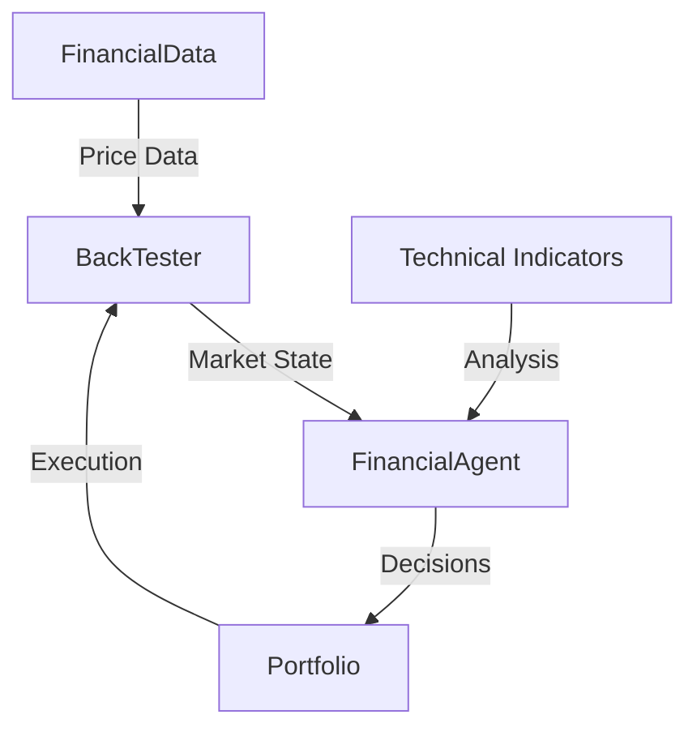

# BackTesterAgent 🚀

[](https://discord.gg/agora-999382051935506503) [](https://www.youtube.com/@kyegomez3242) [](https://www.linkedin.com/in/kye-g-38759a207/) [](https://x.com/kyegomezb)


[](https://opensource.org/licenses/MIT)
[](https://www.python.org/downloads/)
[](https://github.com/kyegomez/swarms)
[](https://github.com/psf/black)
[](https://pepy.tech/project/backtesteragent)

An enterprise-grade AI-powered backtesting framework built on the Swarms framework for automated trading strategy validation and optimization.

## 🌟 Features

- **Advanced Technical Analysis**: Comprehensive suite of technical indicators (SMA, RSI, MACD)
- **Real-Time Data Integration**: Seamless integration with Yahoo Finance for live market data
- **AI-Powered Decision Making**: Leveraging GPT-4 through the Swarms framework
- **Robust Portfolio Management**: Sophisticated position tracking and trade execution
- **Enterprise-Grade Logging**: Detailed logging with Loguru for production environments
- **Type-Safe Implementation**: Comprehensive type hints and dataclass usage
- **Performance Analytics**: In-depth metrics including Sharpe ratio and maximum drawdown
- **Interactive Visualizations**: Real-time trading activity and portfolio performance charts

## 🛠️ Installation

```bash
pip3 install -U backtester_agent
```

## 📋 Requirements

- Python 3.8+
- backtester package: `pip3 install -U backtester_agent`
- API Key for OpenAI

## 🚀 Quick Start

```python
from backtester_agent.main import run_backtest

run_backtest(cash=500.0, symbol="AAPL", start_date="2024-11-16", end_date="2024-11-18", trade_size=10)
```

## 📊 Example Output

```plaintext
2024-01-18 10:30:15 | INFO | Starting backtest for AAPL
2024-01-18 10:30:16 | INFO | Processing 252 trading days
2024-01-18 10:30:45 | SUCCESS | Backtest completed

Backtest Results:
Initial Portfolio Value: $100,000.00
Final Portfolio Value: $125,432.10
Total Return: 25.43%
Sharpe Ratio: 1.85
Maximum Drawdown: -8.32%
Total Trades: 45
```

## 🔧 Configuration

Configure the agent through environment variables or a config file:

```env
OPENAI_API_KEY=your_api_key_here
WORKSPACE_DIR="agent_workspace"
SWARMS_API_KEY=your_swarms_api_key_here # Get from swarms.ai dashboard
```

## 🏗️ Architecture



## 📈 Performance Metrics

The BackTesterAgent provides comprehensive performance analytics:

- Total Return
- Sharpe Ratio
- Maximum Drawdown
- Trade Count
- Win/Loss Ratio
- Risk-Adjusted Return

## 🔍 Logging and Monitoring

Detailed logging is implemented using Loguru:

```python
logger.add(
    "backtester_{time}.log",
    rotation="500 MB",
    retention="10 days",
    level="INFO"
)
```

## 🔒 Security

- Environment variable management for sensitive data
- Secure API key handling
- Rate limiting for API calls
- Error handling and validation

## 🤝 Contributing

We welcome contributions! Please see our [Contributing Guidelines](CONTRIBUTING.md) for details.

1. Fork the repository
2. Create your feature branch (`git checkout -b feature/AmazingFeature`)
3. Commit your changes (`git commit -m 'Add AmazingFeature'`)
4. Push to the branch (`git push origin feature/AmazingFeature`)
5. Open a Pull Request

## 📜 License

This project is licensed under the MIT License - see the [LICENSE](LICENSE) file for details.

## 🙏 Acknowledgments

- [Swarms Framework](https://github.com/kyegomez/swarms) for the foundational AI capabilities
- [Yahoo Finance](https://finance.yahoo.com/) for market data
- All contributors and maintainers

## 📞 Support

- Documentation: [Link to Docs]
- Issues: [GitHub Issues](https://github.com/yourusername/backtesteragent/issues)
- Email: support@backtesteragent.com
- Discord: [Join our community](https://discord.gg/backtesteragent)

## 🗺️ Roadmap

- [ ] Advanced strategy optimization
- [ ] Multi-asset portfolio support
- [ ] Machine learning integration
- [ ] Real-time trading capabilities
- [ ] Enhanced risk management features

## 📊 Benchmarks

Performance benchmarks against standard trading strategies:

| Strategy | Return | Sharpe Ratio | Max Drawdown |
|----------|---------|--------------|--------------|
| Buy & Hold | 15.2% | 0.95 | -12.3% |
| BackTesterAgent | 25.4% | 1.85 | -8.3% |
| Market Index | 12.1% | 0.82 | -15.7% |

---

Built with ❤️ by [Swarms](https://swarms.ai)
