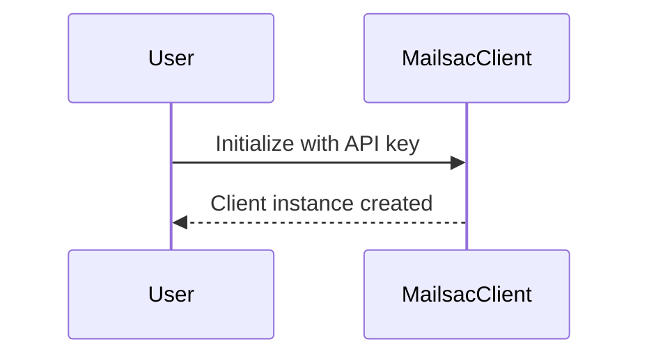
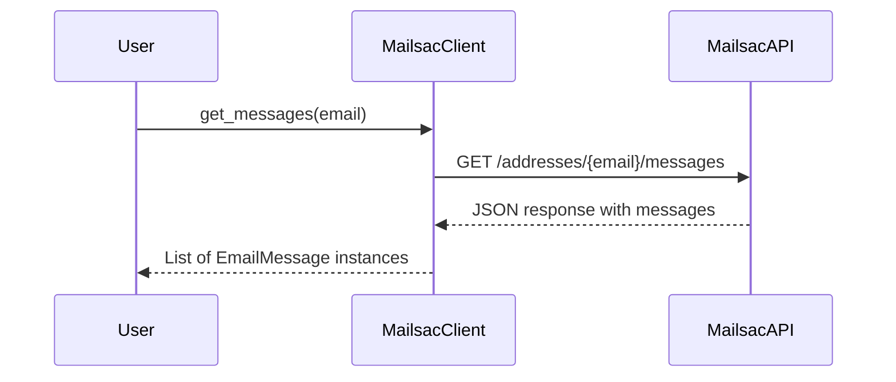
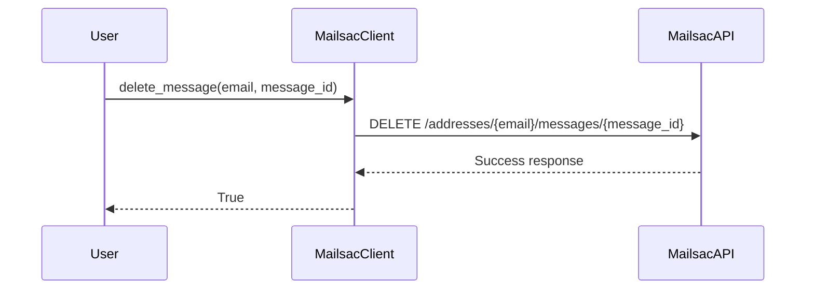

# Mailsac Client Library


This is a Python client library for interacting with the Mailsac REST API. It provides a simple interface to receive, and manage emails using Mailsac's services. See full documentation for the API, here https://mailsac.com/docs/api/#section/About-the-API

## Features

- Retrieve messages from your Mailsac inbox.
- Delete messages from your inbox.

## Installation

To install the Mailsac client library, you can use pip:

```
pip install -r requirements.txt
```

## Usage

Here is a basic example of how to use the MailsacClient:

```python
from mailsac.client import MailsacClient

# Initialize the client
client = MailsacClient(api_key='your_api_key')

# Get messages
messages = client.get_messages('your_inbox_id')

# Delete a message
client.delete_message('your_inbox_id', 'message_id')
```

## Client Initialization



## Fetching Messages



## Deleting a Message



## Contributing

Contributions are welcome! Please feel free to submit a pull request or open an issue for any enhancements or bugs.

## License

This project is licensed under the MIT License. See the LICENSE file for more details.