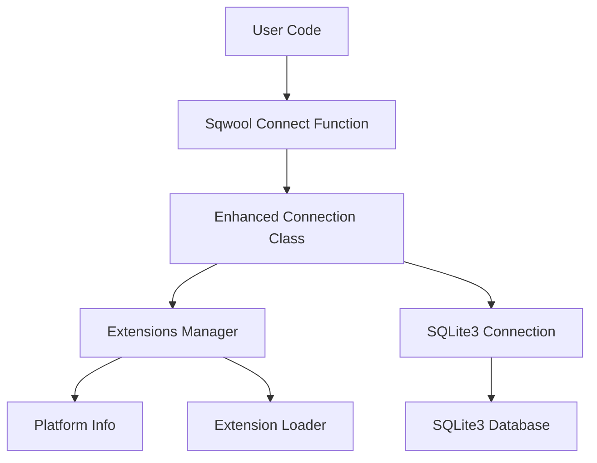

# Sqwool


**Sqwool** is a robust and cross-platform extension manager for SQLite, designed to simplify the integration and management of SQLite extensions in your Python projects. It seamlessly handles platform-specific extension loading, ensuring compatibility across macOS, Windows, and Linux.

## Table of Contents

- [Features](#features)
- [Installation](#installation)
- [Quick Start](#quick-start)
- [Detailed Usage](#detailed-usage)
- [Architecture](#architecture)
- [Example Use Cases](#example-use-cases)
- [Contributing](#contributing)
- [License](#license)

## Features

- **Cross-Platform Support**: Automatically detects and handles platform-specific SQLite extensions for macOS, Windows, and Linux.
- **Seamless Extension Management**: Automatically loads and manages SQLite extensions, reducing boilerplate code.
- **Enhanced Connection Handling**: Extends the native `sqlite3.Connection` to support advanced features and extension loading.
- **Easy Setup**: Simple functions to initialize and manage extension directories.
- **Comprehensive Platform Information**: Provides detailed information about the SQLite build and platform specifics.

## Installation

You can install Sqwool via `pip`:

```bash
pip install sqwool
```

Or clone the repository and install manually:

```bash
git clone https://github.com/yourusername/sqwool.git
cd sqwool
pip install .
```

## Quick Start

Here’s a simple example to get you started with Sqwool:

```python
import sqwool

# Connect to the SQLite database
conn = sqwool.connect('example.db')

# Create a cursor
cursor = conn.cursor()

# Execute a simple query
cursor.execute('CREATE TABLE IF NOT EXISTS users (id INTEGER PRIMARY KEY, name TEXT)')

# Insert a record
cursor.execute('INSERT INTO users (name) VALUES (?)', ('Alice',))

# Commit the transaction
conn.commit()

# Fetch records
cursor.execute('SELECT * FROM users')
users = cursor.fetchall()
print(users)

# Close the connection
conn.close()
```

## Detailed Usage

### Managing Extensions

Sqwool automatically manages and loads SQLite extensions based on your platform. To customize the extensions directory or manage extensions manually, follow these steps:

```python
import sqwool
from pathlib import Path

# Set up custom extensions directory
extensions_dir = sqwool.setup_extension_directories(base_dir='path/to/extensions')

# Connect to the database with custom extensions directory
conn = sqwool.connect('example.db', extensions_dir=extensions_dir)

# Verify if extensions are supported
if conn.extensions_supported:
    print("Extensions loaded successfully.")
else:
    print("Extensions are not supported on this platform.")

conn.close()
```

### Retrieving Platform and SQLite Information

You can retrieve detailed information about your platform and SQLite build:

```python
import sqwool

platform_info = sqwool.get_platform_info()
print(platform_info)

sqlite_build_info = sqwool.get_sqlite_build_info()
print(sqlite_build_info)
```

## Architecture

Sqwool is designed with modularity and extensibility in mind. Below is an overview of its architecture:



### Components

- **PlatformInfo**: Detects the operating system and architecture to determine the appropriate extensions to load.
- **ExtensionsManager**: Manages the loading and validation of SQLite extensions based on the detected platform.
- **Connection**: An enhanced version of `sqlite3.Connection` that integrates with `ExtensionsManager` to load extensions automatically.
- **Connect Function**: A wrapper around `sqlite3.connect` that initializes the enhanced `Connection` and manages extensions.

## Example Use Cases

### 1. Data Encryption with SQLite Extensions

Enhance your SQLite database with encryption capabilities using extensions like [SQLCipher](https://www.zetetic.net/sqlcipher/).

```python
import sqwool

# Initialize connection with encryption extension
conn = sqwool.connect('secure.db', extensions_dir='path/to/extensions')

# Enable encryption (assuming the extension provides such functionality)
conn.execute("PRAGMA key = 'your-encryption-key'")

# Proceed with normal database operations
cursor = conn.cursor()
cursor.execute('CREATE TABLE secrets (id INTEGER PRIMARY KEY, data TEXT)')
cursor.execute('INSERT INTO secrets (data) VALUES (?)', ('Top Secret',))
conn.commit()

conn.close()
```

### 2. Full-Text Search Integration

Integrate full-text search capabilities using the FTS5 extension.

```python
import sqwool

# Connect to the database
conn = sqwool.connect('fts_example.db')

# Create a virtual table for full-text search
conn.execute('CREATE VIRTUAL TABLE documents USING fts5(content)')

# Insert documents
conn.execute("INSERT INTO documents (content) VALUES (?)", ("This is a sample document.",))
conn.execute("INSERT INTO documents (content) VALUES (?)", ("Another example of full-text search.",))
conn.commit()

# Perform a full-text search
cursor = conn.execute("SELECT rowid, content FROM documents WHERE content MATCH 'sample'")
results = cursor.fetchall()
print(results)

conn.close()
```

### 3. Geospatial Data Handling

Utilize geospatial extensions like [SpatiaLite](https://www.gaia-gis.it/fossil/libspatialite/index) for advanced spatial data operations.

```python
import sqwool

# Connect to the database
conn = sqwool.connect('spatial.db')

# Load SpatiaLite extension
conn.load_extension('mod_spatialite')

# Initialize spatial metadata
conn.execute('SELECT InitSpatialMetaData()')

# Create a spatial table
conn.execute('''
    CREATE TABLE places (
        id INTEGER PRIMARY KEY,
        name TEXT
    )
''')
conn.execute('''
    SELECT AddGeometryColumn('places', 'geom', 4326, 'POINT', 'XY')
''')

# Insert a spatial record
conn.execute('''
    INSERT INTO places (name, geom) VALUES (?, GeomFromText('POINT(-122.4194 37.7749)', 4326))
''', ('San Francisco',))
conn.commit()

# Query spatial data
cursor = conn.execute('''
    SELECT name, AsText(geom) FROM places WHERE Within(geom, BuildMbr(-123, 37, -121, 38))
''')
results = cursor.fetchall()
print(results)

conn.close()
```

## Contributing

Contributions are welcome! Please follow these steps:

1. Fork the repository.
2. Create a new branch: `git checkout -b feature/YourFeature`.
3. Commit your changes: `git commit -m 'Add some feature'`.
4. Push to the branch: `git push origin feature/YourFeature`.
5. Open a pull request.

Please ensure your code adheres to the project's coding standards and includes appropriate tests.

## License

This project is licensed under the [MIT License](LICENSE).

---

For more information, visit the [Sqwool GitHub Repository](https://github.com/yourusername/sqwool).
